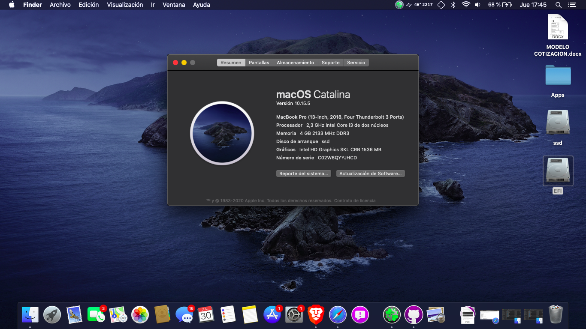
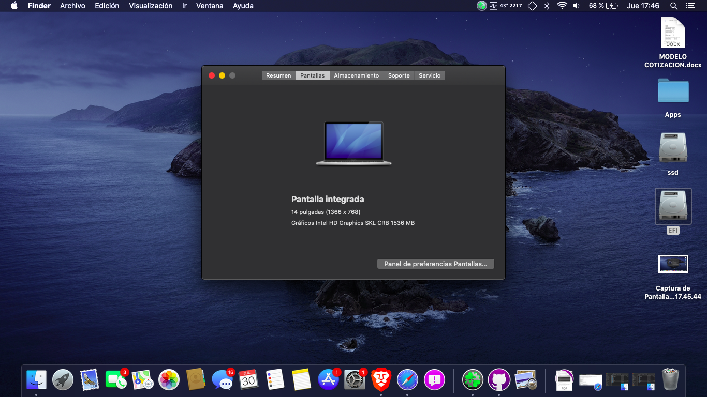
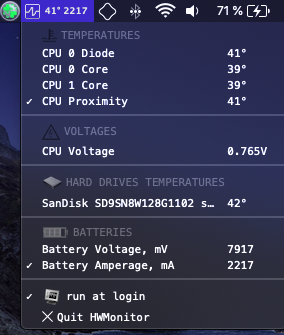
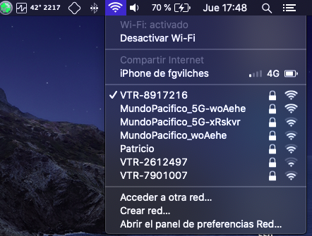
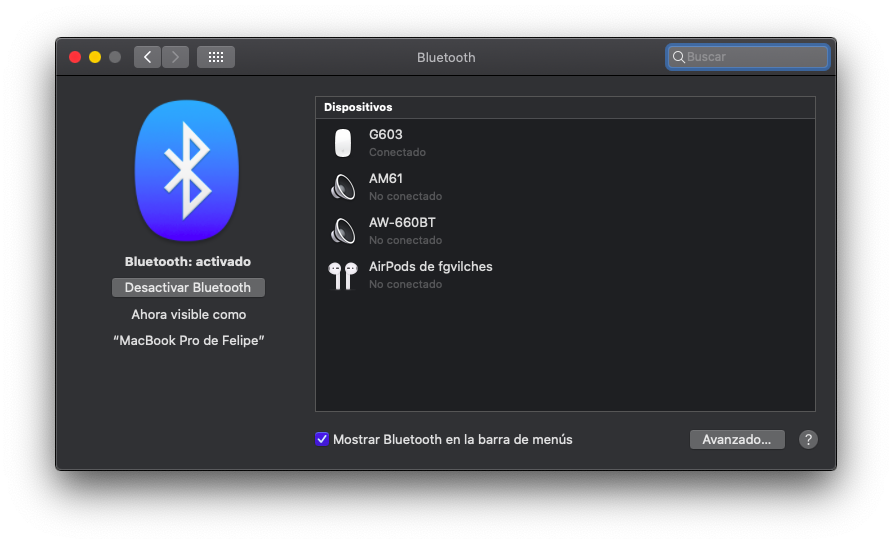
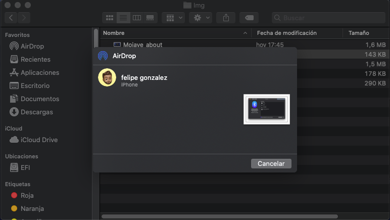
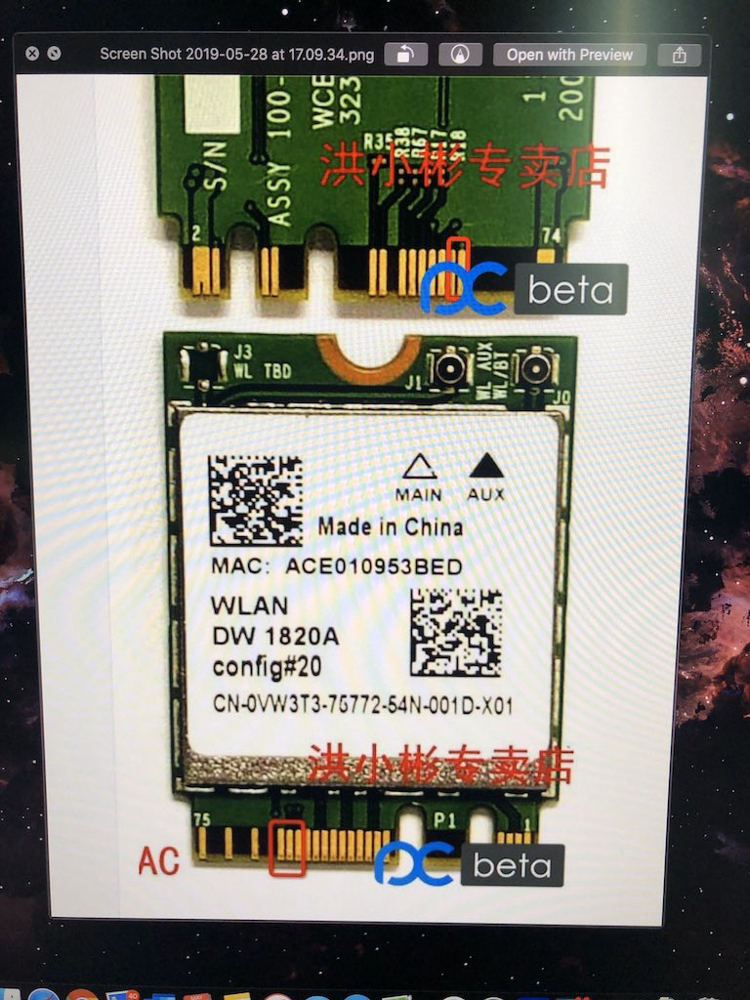

# ASUS VIVOBOOK X420 HACKINTOSH

-----
Run macOS on your Asus X420

**Works fine on Mojave / Catalina** 

   
  
   

   
  
   

   
  
   

   
  
   

   
  
   

   
  
   

## Contents

- [Configuration](#configuration)
- [Current Status](#current-status)
  - [Clover](#clover)
  - [OpenCore](#opencore)
- [Installation](#installation)
  - [First-time installation](#first-time-installation)
- [Improvements](#improvements)
- [FAQ](#faq)
- [Changelog](#changelog)
- [A reward](#a-reward)
- [Credits](#credits)
- [Support and discussion](#support-and-discussion)

## Configuration

| Specifications      | Detail                                     |
| ------------------- | -------------------------------------------|
| Computer model      | Asus Vivobook X420UA                       |
| Processor           | Intel Core i5-7200U Processor              |
| Memory              | 4GB Samsung DDR4L (Soldered) 2133MHz       |
| Hard Disk           | Sandisk 128GB SSD SD9SN8W128G1102          |
| Integrated Graphics | Intel HD Graphics 620                      |
| Sound Card          | Realtek ALC256                             |
| Webcam              | UVC HD Webcam                              |
| Wireless Card       | Intel Wireless 8265 (Replaced with DW1820a)|
| SD Card Reader      | Realtek RTS5129/RTS5250S                   |

## Current Status

- **Intel Wi-Fi (Intel Wireless 8265)** could work by additional configurations (see [this pdf for more details](https://github.com/fgvilches/ASUS-VIVOBOOK-X420-HACKINTOSH/blob/master/Docs/Drive-Native-Intel-Wireless-Card.pdf))
  - I've remplaced it with a DW1820a (hw mod needed)

- **Realtek USB SD Card Reader** It works on mojave but is not working on catalina

- **UVC HD Webcam** Is not working
  - I've tried for months to get it working without result.
  
- **Sleepmode** Is working partially
  - It works. When you close the lid, enters in sleepmode but when you open it to return, the notebook reboots.
  
- Everything else works well

### Clover
- Support macOS10.13 ~ macOS10.15.6, **Currently working on Big Sur Support**
- Should Clean NVRAM after using OpenCore
  - Press `Fn+F11` in Clover boot page

### OpenCore
- I don't have an opencore build currently. **I'm working on one**

## Installation

### First-time installation
- I recommend installing using a pre-made [Olarila dmg](https://www.olarila.com/forum/83-olarila-pre-made-iso-recommended/), after install update clover bootloader and replace the EFI folder with one of mine [releases](https://github.com/fgvilches/ASUS-VIVOBOOK-X420-HACKINTOSH/releases).

- If the trackpad doesn't work during the installation, please plug a wired mouse or a wireless mouse before the installation. After the installation completes, open Terminal.app and run sudo kextcache -i /. Wait for the process ending and restart the device. Enjoy your trackpad!

#### DW1820a-Fix
- To get fully working the DW1820a on Mojave/Catalina you need to tape out some pins with masking tape, if you don't do this, you are gonna get your pc stuck after 20 mins by cpu overload (caused by airportd process)
  - Tape diagram:
    

       
      
       
    

  - You also need to use my config.plist, because has the mods in devices tab to get this working.
  - Done, you have an Airdrop/HandOff capable Wifi/Bluetooth card, detected as an Airport Extreme.
  
- Remember fix your the SMBIOS on Clover configurator (Generate a valid serial number an board), because I deleted my SerialNumber an Board for obvious reasons.
  - With that you get Facetime/iMessage Working.
  
## Improvements
- Use [ALCPlugFix](ALCPlugFix) to fix unworking jack after replug
- Use [itlwm](https://github.com/OpenIntelWireless/itlwm) and [HeliPort](https://github.com/OpenIntelWireless/HeliPort) if you are gonna use the Intel Wi-Fi card, the tutorial is [here](https://github.com/fgvilches/ASUS-VIVOBOOK-X420-HACKINTOSH/blob/master/Docs/Drive-Native-Intel-Wireless-Card.pdf)
- Use my DW1820a [fix](https://github.com/fgvilches/ASUS-VIVOBOOK-X420-HACKINTOSH#DW1820a-Fix) if you are gonna use that card.

  

Si este proyecto te ha sido util, considera donarme! 
 

   
  
   

 
 

  

  

  
**Cripto** -> 0x537D586a1ae78645D877db2A9215bF68b697D290
_(ETH,BSC,PolyGon)_

